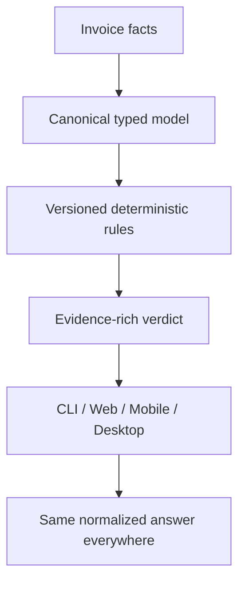
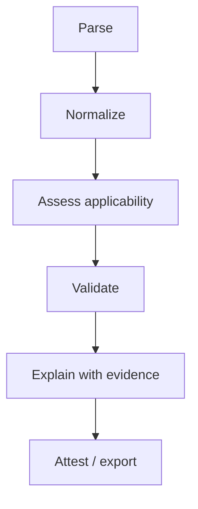

# GSTFlow X-Ray Review

## From promising deterministic kernel to a trusted GST preflight standard

**Repository:** [CanonFlowFoundation/GSTFlow](https://github.com/CanonFlowFoundation/GSTFlow)  
**Reviewed commit:** [`2c88420`](https://github.com/CanonFlowFoundation/GSTFlow/commit/2c88420904254402ea0cccd719ab101d11864841)  
**Review date:** 13 July 2026  
**License presented by repository:** Apache-2.0  
**Review type:** Source, architecture, rule-model, test, CI/CD, release, privacy, licensing, and product-trust review

> **Bottom line:** GSTFlow is an unusually strong *direction* wrapped around an early alpha implementation. The F# kernel, offline-first posture, explicit `Unknown` outcome, multi-runtime ambition, and Apache-2.0 distribution model are genuinely distinctive. But the current software is not yet a reliable GST compliance product, a mathematically verified system, or a three-channel production ecosystem. It is a four-day-old, high-velocity prototype whose breadth has outrun its evidence.

GSTFlow can still become important. Its fortune-changing form is not “an app that knows GST.” It is an open, deterministic **GST invoice preflight standard** that says exactly what was checked, against which dated rule, from which evidence, with the same result on every supported runtime—and refuses to turn missing facts into a green tick.

---

## 1. Executive verdict

### What GSTFlow is today

GSTFlow is a working proof of concept for a deterministic invoice-validation kernel with:

- an F# domain model and rules module;
- a CLI and NativeAOT bridge;
- Fable-generated TypeScript and Dart targets;
- a deployed browser playground;
- GSTIN format/checksum, basic invoice sanity, tax split, approximate arithmetic, HSN-length, cess, document-reference, IRN-format, POS, SEZ, and rudimentary RCM checks;
- fixtures, FsCheck properties, GitHub Actions, bilingual web explanations, and an honest “what we cannot prove” idea.

### What GSTFlow is not yet

It is not yet:

- a comprehensive GST validator;
- an authoritative validator of legal tax treatment;
- a formal or mathematical proof system;
- a byte-identical cross-runtime oracle;
- a production Android or Windows product;
- a cryptographically signed attestation system;
- a bundled local-AI invoice extractor;
- a release-ready Apache-only distribution;
- or a defensible way to promise that an invoice is “ready to file” or “100% compliant.”

### Maturity scorecard

| Dimension | Score | X-ray finding |
|---|---:|---|
| Problem selection | 9/10 | Costly GST mistakes, privacy, explainability, and deterministic preflight are real Indian-market problems. |
| Architectural direction | 7/10 | Typed core, explicit outcomes, offline execution, and portable rules are the right bones. |
| Rule-engine implementation | 4/10 | Small and understandable, but several rules overstate what can be inferred from the available facts. |
| GST domain coverage | 2/10 | Useful narrow checks; large parts of invoice validity, place of supply, RCM, returns, ITC, e-invoice, and reconciliation are absent. |
| Evidence and provenance | 1/10 | The envelope types anticipate evidence, but results currently contain blank paths, no values, no legal references, and no effective dates. |
| Cross-channel agreement | 2/10 | Common source exists, but actual CLI/JS/Dart/Native equivalence is not proved and the mobile generated-code path has drifted. |
| Test discipline | 4/10 | Good instinct—properties and planted falsifiers—but the corpus is tiny, the agreement gate is not an agreement test, and artifact CI is red. |
| Privacy posture | 5/10 | Browser validation is local, but offline claims lack network-denial tests and one PDF path references a CDN worker. |
| Release and supply chain | 1/10 | No public releases; artifact workflow fails; no production signing, SBOM, provenance, or security policy. |
| Production readiness | **2/10** | Alpha/research prototype. Do not position as filing assurance yet. |

These scores are not a rejection of the mission. They identify the shortest path from impressive prototype to credible public infrastructure.

---

## 2. The technical idea that genuinely stands out

The standout idea is this chain:



Most GST products begin with forms, APIs, or an AI extractor and then scatter validation across UI code. GSTFlow begins with a rule kernel and tries to make every channel a projection of the same decision. That is the correct inversion.

Three choices are particularly valuable:

1. **F# as the rule authoring language.** Discriminated unions and records can make illegal or unknown states explicit. This can produce a smaller, auditable decision core than a conventional mutable service layer.
2. **An explicit verdict envelope.** `RuleMetadata`, `Evidence`, `RuleResult`, and `VerdictEnvelope` are the beginnings of a durable assurance contract—not merely a list of error strings.
3. **Offline-first execution.** GST invoices contain commercially sensitive data. Local browser/native execution is a credible adoption and privacy advantage, especially for accountants and small businesses that will not upload entire purchase books to an unknown server.

The moat, however, will not be F# itself. Under Apache-2.0, others can reuse the engine. The durable moat will be:

- the most trusted dated rule pack;
- the best redacted real-invoice and falsifier corpus;
- CA-reviewed interpretations and counterexamples;
- reproducible cross-runtime agreement;
- integrations with the formats Indian businesses already use;
- and a governance reputation for never converting uncertainty into false assurance.

---

## 3. How the project evolved—and where the turn occurred

The Git history shows **123 commits between 9 and 13 July 2026**. That velocity is remarkable, but it also explains the current shape.

| Evolution stage | What happened | Assessment |
|---|---|---|
| Skeleton | F# Core → Rules → Emit → CLI/Wasm boundaries appeared. | Strong start: architecture before UI. |
| Rule kernel | GSTIN checksum, interstate/intrastate checks, tax arithmetic, fixtures, and FsCheck properties were added. | Correct direction; narrow enough to reason about. |
| Trust UX | Hindi explanations, offline messaging, confirmation concepts, and an honest catch-errors matrix appeared. | Product thinking aligned with the mission. |
| Breadth expansion | ZIP/CFF, NativeAOT FFI, Flutter desktop/mobile, QR scanning, local-AI extraction, and multiple build workflows arrived rapidly. | This is where surface area outran verified behavior. |
| Public positioning | README declared the tri-channel ecosystem “100% Complete,” “mathematically verified,” signed CFF, bundled AI, and downloadable artifacts. | Claims moved beyond what the repository and release state prove. |

The next evolution should deliberately reverse the ratio: **freeze channel expansion and deepen the kernel, evidence contract, corpus, and agreement gates.** GSTFlow does not need a fourth channel. It needs one result that can be trusted.

---

## 4. What went well

### 4.1 The project preserved a recognizable core

Despite rapid growth, the main GST rules remain concentrated in [`GSTFlow.Rules/Library.fs`](https://github.com/CanonFlowFoundation/GSTFlow/blob/2c88420904254402ea0cccd719ab101d11864841/GSTFlow.Rules/Library.fs). The CLI, Wasm/Fable, Dart, and Native layers call the same compiler instead of maintaining four independent rule sets. That is an important architectural win.

### 4.2 Unknown was modeled as a first-class outcome

`Pass | Warning | Fail | Unknown` is a better foundation than a Boolean validator. In tax validation, absence of evidence is common. An engine that can say “I cannot derive place of supply safely” has the right philosophical starting point.

### 4.3 The team used falsifiers, not only happy-path demos

The fixtures include bad GSTIN checksum, illegal mixed taxes, off-slab rate, missing invoice essentials, and RCM examples. The tests also attempt property-based laws. This is better than screenshot-driven development.

### 4.4 Main kernel CI and web deployment are live

For reviewed commit `2c88420`, the public [core CI run](https://github.com/CanonFlowFoundation/GSTFlow/actions/runs/29230729362) and [Pages workflow](https://github.com/CanonFlowFoundation/GSTFlow/actions/runs/29230729229) completed successfully. The project is not vaporware: the F# solution builds in CI, the current fixture assertions run, Fable compiles the web target, and the site deploys.

### 4.5 The README contains the seed of the correct promise

The strongest existing sentence is essentially: *tell users what was checked, what evidence was used, and what remains unknown.* That should become the constitution of the product. It is far stronger than “AI-powered compliance.”

### 4.6 Apache-2.0 is strategically appropriate

For a rules engine that may be embedded in accounting systems, ERP connectors, government-adjacent tooling, and CA workflows, Apache-2.0 lowers adoption fear and includes an explicit patent grant. This is a good license for becoming infrastructure.

---

## 5. What the engine actually checks today

The engine contains 21 operational rule identifiers. Its present scope is best described as **selected structural and internal-consistency checks on a custom invoice JSON shape**.

| Area | Current check | Important limitation |
|---|---|---|
| GSTIN | Length/pattern, embedded PAN shape for domestic GSTIN, Mod-36 check digit | Does not establish registration status, taxpayer identity, activity, filing status, or invoice ownership. |
| Party/state | GSTIN prefix equals supplied state code | User-supplied data can be internally consistent and factually false. |
| Basic document sanity | Nonblank invoice number/date, at least one item, nonnegative taxable value/rate | Date is only a nonblank string; invoice-number length/character/FY rules are absent. |
| Document type | INV/CRN/DBN and original-reference presence for notes | No legal/date/value relationship to the original document is proved. |
| IRN | Optional value is 64 hex characters | Does not regenerate, authenticate, query, or validate the IRP-signed QR/IRN. |
| HSN | Exactly 4, 6, or 8 digits | Does not prove the code exists, is required at that length, matches the product, or attracts the stated rate. |
| Rate | Membership in a hard-coded slab list | No commodity/service applicability, notification history, exemption, or effective-date logic. |
| Tax kind | IGST versus CGST/SGST based on derived interstate flag | The interstate flag depends on an oversimplified POS model. |
| Arithmetic | Taxable value × rate, with a tolerance of ₹0.50 | This is approximate, not exact; invoice-level declared totals, discounts, other charges, and quantity are absent from the schema. |
| Cess | Percentage arithmetic when cess rate/value is supplied | Does not determine whether cess legally applies or support non-ad-valorem cess structures. |
| RCM | Zero tax when invoice says RCM; broad HSN-prefix inference when it does not | RCM depends on notification, supplier/recipient classes, options, exemptions, and context—not HSN prefix alone. |
| POS | Explicit state code or buyer state fallback; unknown for unregistered buyer without POS | Goods and services have multiple statutory POS branches; buyer state is not a universal answer. |
| Rounding | Warns when computed final total has paise | No declared invoice total exists to reconcile against, and the legal/IRP rounding model is more nuanced. |
| Batch duplicate | Seller GSTIN + invoice number within one directory | Financial year, series, document type, and source scope are not included. |

There is **no defensible coverage percentage yet**. A statement such as “catches 30–40% of GST errors” would require a labeled, representative invoice corpus and a published methodology. Today, the safe claim is narrower:

> GSTFlow detects a defined set of structural and arithmetic inconsistencies in its supported JSON schema. It does not establish that the tax treatment, business facts, filing status, or legal compliance of the invoice are correct.

---

## 6. Critical findings: the current trust gap

### P0 — Must be fixed before inviting taxpayers to rely on results

| Finding | Evidence | Why it matters | Required action |
|---|---|---|---|
| ~~**The web can display “Ready to File” and “100% compliant with the CGST Act.”**~~ | ~~[`App.tsx` lines 478–484](https://github.com/CanonFlowFoundation/GSTFlow/blob/2c88420904254402ea0cccd719ab101d11864841/playground/src/App.tsx#L478-L484)~~ | ~~The input schema cannot prove broad compliance. This is the highest product-liability and trust risk.~~ | ~~Replace with “No issue found in the supported checks” and show checked/unknown/out-of-scope counts.~~ |
| ~~**Unknown and Warning can become success.**~~ | ~~Wasm exposes only `Fail` entries and considers an existing IR successful; CLI prints success for `IR = Some`; mobile checks a numeric tag.~~ | ~~Missing POS can be `Unknown` yet channels can still show a green result. Unknown must never silently become Pass.~~ | ~~Define one status reducer in the core. Channel code must consume `OverallOutcome`; `Unknown` must produce CHECK, never PASS.~~ |
| ~~**Mobile reads the wrong union tag.**~~ | ~~[`scanner_page.dart` line 46](https://github.com/CanonFlowFoundation/GSTFlow/blob/2c88420904254402ea0cccd719ab101d11864841/flutter_app/lib/scanner_page.dart#L46) says tag 1 is Fail; the F# order makes tag 1 `Warning` and tag 2 `Fail`.~~ | ~~Mobile can miss actual failures and treat warnings as failures.~~ | ~~Export named predicates/status strings; never bind UI logic to generated union tag numbers. Add planted mobile failures.~~ |
| ~~**Subject hashes are placeholders.**~~ | ~~[`Hash.computeSha256`](https://github.com/CanonFlowFoundation/GSTFlow/blob/2c88420904254402ea0cccd719ab101d11864841/GSTFlow.Core/Library.fs#L47-L50) returns `hash_not_computed`; Wasm uses another literal placeholder.~~ | ~~Verdicts cannot be bound to the reviewed subject, so auditability and agreement claims collapse.~~ | ~~Canonicalize input, calculate SHA-256 on every target, and test identical bytes/digest across targets.~~ |
| ~~**CFF is a checksum, not a cryptographic signature.**~~ | ~~[`ZipUploader.tsx` lines 21–42](https://github.com/CanonFlowFoundation/GSTFlow/blob/2c88420904254402ea0cccd719ab101d11864841/playground/src/ZipUploader.tsx#L21-L42) stores an unkeyed SHA-256 as `canonflow_signature`.~~ | ~~Anyone can modify the payload and recompute the hash. It proves accidental integrity only, not origin or attestation.~~ | ~~Rename to `payload_digest`; remove “signed”/“signature” language. Later use a real asymmetric signature over canonical payload + verdict + rule-pack manifest.~~ |
| **Rule messages and evidence are discarded.** | `createRule outcome id _` ignores its message; `MessageKey = id`; evidence path/value are empty; references and effective dates are `None`. | The public promise to show what was proved and from which evidence is not implemented. | Make results carry actual parameters, evidence paths/values, derivation, source citation, jurisdiction, and effective window. Emit Pass results too. |
| ~~**RCM is over-inferred from broad HSN/SAC prefixes.**~~ | ~~`9965`, `9967`, `9973`, `9982`, `9983`, and `9985` are treated as mandatory RCM categories.~~ | ~~Entire headings are not universally subject to RCM. The recipient class, supplier class, exemptions, options, and notification conditions matter. This will create dangerous false positives.~~ | ~~Remove automatic `RCM_LAW` until a fact-complete applicability model exists. Use `Unknown/NeedsFacts` with explicit questions.~~ |
| ~~**Place of supply is under-modeled.**~~ | ~~Registered-buyer state is used as the default POS; no supply-kind-specific statutory branch exists.~~ | ~~POS for goods can depend on movement termination, bill-to/ship-to, installation, onboard supply, and more; services have general and exception rules. Wrong POS means wrong tax type.~~ | ~~Introduce a POS decision tree with `Goods/Services`, movement, delivery, installation, recipient status, and exception facts. Otherwise return Unknown.~~ |
| ~~**Artifact ecosystem is not complete.**~~ | ~~Latest [Build Flutter Apps run](https://github.com/CanonFlowFoundation/GSTFlow/actions/runs/29230729216) failed for Android tests, Windows build, and Playwright. [GitHub Releases is empty](https://github.com/CanonFlowFoundation/GSTFlow/releases).~~ | ~~README says artifacts are automatically built and instantly downloadable. They are not.~~ | ~~Mark mobile/desktop experimental; make every release job green; publish signed prereleases only after installation smoke tests.~~ |
| **Flutter source and generated engine have drifted.** | Parser passes five arguments to a four-field `TaxAmount`; app imports `fable_dart`, while release workflows generate into `lib/fable/Core` and `lib/fable/Rules`. | The “one engine” build is not actually wired as one reproducible path. This is consistent with the red Flutter jobs. | Delete committed generated variants; choose one generated directory; generate it in every build; fail on post-generation diff; compile the app against that exact output. |
| **Bundled local AI is not present.** | No model assets are declared; [`pdf_extractor.dart`](https://github.com/CanonFlowFoundation/GSTFlow/blob/2c88420904254402ea0cccd719ab101d11864841/flutter_app/lib/pdf_extractor.dart) calls an externally installed Ollama `llama3` endpoint and is not referenced by the UI. | README claims bundled `llama.cpp` + Phi-3 and a seamless workflow. | Describe it as an unintegrated experiment or remove it. Keep extraction outside the verdict path and require user confirmation. |

### P1 — Must be fixed before a public beta

1. **No positive proof is emitted.** `Envelope.Results` is effectively a list of problems. A passing invoice usually has an empty result list, so users cannot see which rules ran or were skipped.
2. **“Mathematically verified” is inaccurate.** FsCheck performs randomized property testing; it is valuable, but it is not formal verification. There is no proof assistant, exhaustive finite model, refinement proof, or machine-checked theorem artifact.
3. **“Exact arithmetic” is inaccurate.** A difference is accepted up to ₹0.50, and CGST/SGST is derived by rounding total GST and splitting it. Exactness, legal tolerance, and IRP tolerance should be separate concepts.
4. **Early failure suppresses additional findings.** Foundational failures return before POS and item checks, so one invoice may not receive the complete exception list users expect.
5. **Stringly typed facts remain pervasive.** State code, invoice date, document number, and reverse-charge values are strings. `ReverseCharge = "YES"` silently becomes false, and date syntax is not parsed.
6. **`URP` can crash party validation.** `GSTIN.create "URP"` succeeds, but party validation then calls `Substring(0,2)` on it. The later self-invoice branch for an unregistered seller is effectively unreachable safely.
7. **No temporal law model exists.** Rule-set version is a hard-coded date; legal references, effective-from/until, notification amendments, and applicability facts are empty or absent.
8. **ZIP handling lacks resource controls.** The browser loads entire archives, with no compressed/uncompressed size, file-count, nesting, or time limits. “Massive ZIP” needs worker isolation, quotas, cancellation, and benchmarks.
9. **Raw-clone developer workflow is not reproducible.** Web source requires a preceding Fable generation step; `npm test` also collects the Playwright test as Vitest. The successful Pages pipeline hides this onboarding gap.
10. **The CI-named “agreement test” does not compare runtimes.** CI runs the JS fixture script only; it does not invoke and compare CLI output. The separate `test_agreement.sh` is not in CI, contains `|| true`, and has stale hash replacement assumptions.

---

## 7. GST and real-world blind spots

GSTFlow’s most important product discipline is to distinguish **internal consistency** from **external truth**.

### 7.1 Facts the current invoice cannot prove by itself

- whether supplier and recipient GSTINs were active on the invoice date;
- whether the named parties actually issued/received the invoice;
- whether goods/services, quantity, value, and delivery occurred;
- whether the HSN/SAC matches the supply;
- whether the rate/exemption/cess applies on that date;
- whether the invoice appears in GSTR-1, GSTR-2B, or books;
- whether ITC is eligible, blocked, reversed, time-barred, or already claimed;
- whether an IRN/QR was genuinely issued by an IRP;
- whether e-invoicing or e-way bill requirements apply;
- whether fraud, circular trading, duplication across systems, or fabricated evidence exists.

### 7.2 Major invoice scenarios not modeled

- exports, imports, LUT/bond, deemed exports, and supplies to/from SEZ with payment/without payment;
- bill-to/ship-to and third-party delivery;
- goods without movement, installation/assembly, onboard conveyance;
- service POS exceptions: immovable property, events, transport, telecom, banking, insurance, OIDAR, intermediary, and performance-based services;
- composition taxpayers, ISD, e-commerce operator/TCS, TDS, job work, works contract;
- advances, vouchers, continuous supply, reimbursements, discounts, freight, other charges, and valuation adjustments;
- nil-rated, exempt, non-GST, zero-rated, mixed/composite supplies;
- UQC, quantity, unit price, currency/exchange rate, invoice totals, round-off field, recipient address, shipping address, and mandatory declarations;
- amendment/cancellation and financial-year series control;
- return-period and cross-document reconciliation.

The official IGST framework itself branches place-of-supply rules by the nature and circumstances of supply, not merely by buyer state. CBIC’s IGST material describes goods movement termination and multiple service-specific branches. The engine should encode those branches only when it has the necessary facts. [CBIC IGST source](https://cbic-gst.gov.in/aces/Documents/IGST-bill-e.pdf)

RCM is likewise notification- and party-condition-driven. Official notifications identify the category of supply, supplier, and liable recipient; a SAC heading by itself is insufficient. [CBIC Notification 10/2017—Integrated Tax (Rate)](https://cbic-gst.gov.in/hindi/pdf/integrated-tax-rate/Notification10-IGST.pdf)

HSN reporting also depends on taxpayer and transaction context. CBIC material records six-digit reporting for higher-turnover taxpayers and four-digit reporting for B2B supplies in the relevant period; checking only 4/6/8 numeric length cannot establish compliance. [CBIC Notification 14/2022](https://cbic-gst.gov.in/pdf/central-tax/NN-14-2022-English.pdf)

Rule 46 includes invoice-number constraints—consecutive series, no more than 16 characters, restricted special characters, and financial-year uniqueness—that the current “nonblank only” check does not cover. [CBIC CGST Rules](https://cbic-gst.gov.in/pdf/03042020-CGST-Rules-2017-Part-A-Rules.pdf)

---

## 8. CI, testing, and release reality

### What is green

- F# restore/build on Ubuntu;
- current xUnit/FsCheck suite;
- CLI fixture shell assertions;
- Fable TypeScript generation;
- JS planted-fixture assertions;
- web build and GitHub Pages deployment.

### What is red or unproved

- Android Flutter test job;
- Windows Flutter build job;
- Playwright job in the artifact workflow;
- installation tests for Windows/Android;
- NativeAOT runtime smoke test—the main CI uses `dotnet run`, not a published AOT binary;
- CLI ↔ JS ↔ Dart ↔ Native normalized-envelope equivalence;
- byte-identical or semantic agreement across decimal/JSON behavior;
- reproducibility from a clean clone;
- release artifacts and signatures;
- network-denial/privacy tests;
- performance and large-archive limits;
- fuzzing of JSON decoders and FFI boundaries;
- mutation testing to prove planted tests kill rule defects;
- coverage reporting and trend gates.

There are also NativeAOT warnings around reflection-based `System.Text.Json` serialization. A source-generated serialization context should be used for an AOT boundary.

### Required agreement gate

For every corpus specimen, every target must emit the same **canonical semantic envelope**:

```text
parse status
canonical subject digest
rule-pack id/version/digest
ordered rule id + applicability + outcome
normalized evidence paths/values
parameters
overall status
```

Timestamps and channel-specific presentation must be outside the compared object. Agreement should run across:

- .NET CLI;
- Fable TypeScript/JavaScript;
- Fable Dart;
- NativeAOT FFI;
- and, where applicable, a golden JSON Schema validator.

Do not call this “byte-identical” until canonical JSON, decimal formatting, ordering, Unicode normalization, and hashing are specified and tested.

---

## 9. Apache-2.0: opportunity and hidden obligations

Apache-2.0 is a powerful choice for adoption, but the current repository is not yet license-clean as a complete distribution.

### Current concerns

- Root [`package.json`](https://github.com/CanonFlowFoundation/GSTFlow/blob/2c88420904254402ea0cccd719ab101d11864841/package.json) declares `ISC`, while the repository license is Apache-2.0.
- Flutter depends on `syncfusion_flutter_pdf`. Syncfusion states that the package requires either its commercial license or its Community License; it is not simply Apache-2.0 downstream code. [Package notice](https://pub.dev/packages/syncfusion_flutter_pdf)
- There is no third-party notices file, SBOM, dependency license report, security policy, contribution guide, or release provenance.
- Android release configuration uses debug signing; Windows artifacts are not code-signed.
- Generated `bin/`, `obj/`, Playwright report, and test-result files are committed; the repository has no effective hygiene boundary and carries 172 generated/test-output paths.

### Recommended model

1. Keep the **core engine and open rule-pack format Apache-2.0**.
2. Replace Syncfusion with a permissively licensed PDF/text extraction dependency, or isolate it as an optional separately licensed adapter with explicit notices.
3. Add `NOTICE`, `THIRD_PARTY_NOTICES`, SPDX identifiers, SBOM generation, Dependabot/Renovate, CodeQL, and dependency/license scanning.
4. Sign release commits/tags and binaries; publish checksums, SBOM, and build provenance.
5. Add a trademark policy. Apache-2.0 lets others reuse code; it does not require allowing them to present modified engines as “official GSTFlow.”

The open-source business truth is important: Apache-2.0 can increase reach dramatically, but it prevents code secrecy from being the moat. Trust, certification, corpus, integrations, and governance must be the moat.

---

## 10. The product position that can change fortunes

### Do not compete as “another GST filing app”

GSTFlow should become the **preflight layer beneath filing tools**, not a replacement for GSTN, IRP, an ERP, or a chartered accountant.

Its strongest promise is:

> Before you file, GSTFlow runs a public, dated set of deterministic checks locally; shows the evidence for every result; separates failures from missing facts; and gives the same verdict in every supported environment.

This can help three groups differently:

| User | Valuable outcome | Required interface |
|---|---|---|
| Small taxpayer | “What is visibly wrong, what should I ask my accountant, and what remains unchecked?” | Simple upload/confirm/result flow; no legal absolutes. |
| Accountant/CA | Fast triage across thousands of invoices with evidence, exceptions, filters, and exportable workpapers. | Desktop/CLI batch engine, Excel/Tally/ERP adapters, rule-pack selection, audit trail. |
| Software integrator | Stable open contract to prevent malformed or inconsistent documents before GSTN/IRP submission. | Versioned JSON Schema, SDK/CLI, deterministic exit codes, signed rule-pack manifests. |

### The first narrow market wedge

Focus v0.1 on **GST invoice structural preflight**, not “GST compliance”:

1. e-invoice JSON/schema and published IRP validation-style checks;
2. Rule 46 invoice-field checks where inputs are sufficient;
3. internal arithmetic and invoice-level reconciliation;
4. GSTIN syntax/state consistency, clearly separated from live registration status;
5. explicit `Unknown` for rate, HSN semantics, POS, RCM, and filing status unless sufficient facts or authoritative data are supplied.

The official IRP troubleshooting catalogue already documents many concrete API validation failures—item totals versus invoice totals, invalid HSN, and other structural errors. These are excellent deterministic targets because they are bounded and observable. [IRIS IRP troubleshooting catalogue](https://einvoice6.gst.gov.in/content/kb/troubleshooting-common-errors/)

---

## 11. What to do next

### Phase 0 — Trust reset (next 7 days)

1. Label all channels **Alpha / Not for filing decisions**.
2. Remove or rewrite: “first mathematically verified,” “bulletproof compliance,” “100% compliant,” “ready to file,” “cryptographically signed,” “tri-channel 100% complete,” “bundled Phi-3/llama.cpp,” and “downloadable artifacts.”
3. Make `Unknown` and `Warning` visible and non-green everywhere.
4. Fix mobile union-tag logic and Flutter generated-code drift.
5. Replace placeholder subject hashes with real canonical hashes.
6. Rename CFF `signature` to `digest`, or temporarily remove CFF.
7. Disable or demote automatic RCM and default POS conclusions that lack sufficient facts.
8. Make Android, Windows, and Playwright jobs green before merging new features.
9. Remove generated build/test output; add `.gitignore` and a clean-clone build script.
10. Reconcile Apache/ISC metadata and resolve the Syncfusion license path.

### Phase 1 — Assurance kernel (next 30 days)

Refactor the engine into explicit stages:



Each rule definition should require:

- stable rule id and version;
- jurisdiction and legal source;
- effective-from/effective-until;
- required facts;
- applicability result: `Applicable | NotApplicable | NeedsFacts`;
- outcome: `Pass | Check | Fix | Unknown`;
- evidence paths and normalized values;
- expected/actual/tolerance parameters;
- examples, counterexamples, and CA review record.

Make the core total and typed:

- parsed dates, constrained state codes, money/rate types, and document identifiers;
- no `failwith` or unchecked `Substring` in the verdict path;
- accumulated errors rather than early return;
- explicit severity ordering rather than relying on union declaration order;
- a single core reducer for overall status;
- Pass and NotApplicable results, not only violations.

### Phase 2 — Evidence and agreement (30–60 days)

1. Build a **gold corpus**: at least 500 designed specimens and 1,000 legally reviewed/redacted real invoices across major scenarios.
2. Publish corpus composition and measure per-category recall, false-positive rate, unknown rate, and coverage—not one inflated global percentage.
3. Run real cross-target agreement on every specimen and on generated/fuzzed boundary cases.
4. Add mutation testing; a rule change that survives all tests reveals a weak corpus.
5. Add canonical JSON and rule-pack digests.
6. Produce a machine-readable coverage manifest showing Supported / Conditional / Unknown / Out of scope.
7. Add no-network tests, archive quotas, cancellation, workers, and performance budgets.

### Phase 3 — Trustworthy distribution (60–90 days)

1. Ship a signed **v0.1.0-alpha**, not v1.0.
2. Publish source tag, reproducible build instructions, SBOM, checksums, signatures, provenance, and known limitations.
3. Add clean adapters for GST e-invoice JSON, CSV/Excel, and one high-value accounting ecosystem; keep adapters outside the rule kernel.
4. Make PDF/AI extraction an explicitly probabilistic intake step with field confidence and mandatory confirmation. Never allow it to alter rule results.
5. Establish a rule-review board with at least one practicing CA/tax lawyer and one independent engineer.
6. Publish a vulnerability/security policy and a responsible rule-correction process.

---

## 12. Launch gates that should replace “feature complete”

GSTFlow is ready for a public beta only when all of these are true:

| Gate | Required evidence |
|---|---|
| Truthful UX | No screen equates supported-check success with full legal compliance or filing readiness. |
| Status safety | Every planted `Fail` and `Unknown` is displayed correctly on every channel. |
| Rule provenance | 100% of active rules have source, effective date, applicability facts, and CA review status. |
| Evidence completeness | Every applicable result reports input paths, actual/expected values, and derivation. |
| Agreement | CLI, JS, Dart, and Native emit the same canonical semantic envelope for the entire gold corpus. |
| Corpus quality | Published scenario coverage, false-positive rate, false-negative rate for labeled categories, and unknown rate. |
| Release health | Clean-clone builds; all CI jobs green; signed installable artifacts; smoke-tested on supported OS versions. |
| Privacy | Automated no-network verdict-path test; documented threat model; zero telemetry by default. |
| Supply chain | SBOM, third-party notices, license scan, dependency scan, signed tags/binaries, provenance. |
| Human validation | Independent CA review and pilot feedback from real accountants using redacted data. |

---

## 13. Recommended public wording now

### Replace the headline

**Current direction:** “The first mathematically verified… GST validation engine.”

**Safe alpha headline:**

> **Open, offline GST invoice preflight—deterministic checks with visible limits.**

### Replace the green verdict

**Do not say:** “Ready to File” or “100% compliant with the CGST Act.”

**Say:**

> **No issue found in 12 supported checks**  
> 3 areas need confirmation · 27 areas were not assessed  
> This is a preflight result, not filing approval or tax advice.

### Replace the CFF language

**Do not say:** “Cryptographically signed CFF.”

**Say now:**

> “CFF includes a SHA-256 payload digest for accidental-change detection.”

After real signing exists:

> “This verdict was signed by key X over canonical subject digest Y and rule-pack digest Z.”

### Replace the channel claim

**Do not say:** “Tri-Channel Ecosystem (100% Complete).”

**Say:**

> “Web prototype available; mobile and Windows channels are experimental and not yet released.”

Honesty will not weaken GSTFlow. In this category, honesty *is the product*.

---

## 14. Final assessment

GSTFlow has more strategic clarity than its current maturity score suggests. The core insight is sound: GST assurance should be deterministic, inspectable, locally executable, and explicit about unknowns. The F# architecture can support that mission, and Apache-2.0 can make the result widely embeddable.

But today, the project is standing at a dangerous fork:

- One path adds more UI, AI, platforms, and claims. That creates an impressive demo whose green tick cannot be trusted.
- The other path slows down, shrinks the promise, makes every rule evidence-bearing and dated, proves cross-runtime agreement, builds a serious corpus, and publishes limitations as carefully as features.

The second path is the one that can change fortunes.

The highest-value next action is therefore not another GST rule or another app shell. It is a **Trust Reset release**: truthful wording, safe status semantics, real evidence, real hashes, removal of over-inferred RCM/POS conclusions, one generated-engine path, and all distribution CI green. After that, GSTFlow can grow rule by rule without losing its constitutional advantage.

---

## Appendix A — Review evidence and limitations

This review examined the current repository tree, Git history, F# projects, generated TypeScript/Dart, Flutter and React sources, fixtures, tests, six GitHub Actions workflows, public workflow results, tags/releases, package metadata, and official GST/IRP material.

Verification performed:

- clean clone at commit `2c88420`;
- source inventory of 424 relevant non-build paths, plus separate inspection of tracked build/test artifacts and hidden CI configuration;
- public GitHub Actions status inspection;
- public GitHub release/API inspection;
- `npm ci` in the playground succeeded;
- raw-clone `npm test` failed because Vitest collected the Playwright test and generated Fable support modules were absent;
- raw-clone `npm run build` failed before the Fable generation step; the separate Pages workflow does perform generation and succeeds;
- .NET and Flutter could not be rerun in the review container because those SDKs were not installed, so their current build evidence comes from public Actions runs.

This is a technical and product-assurance review, not a legal opinion or tax advice. Every GST rule proposed for production still requires current authoritative-source review and qualified professional validation.

## Appendix B — Primary external references

- [CBIC CGST Rules—invoice particulars and numbering](https://cbic-gst.gov.in/pdf/03042020-CGST-Rules-2017-Part-A-Rules.pdf)
- [CBIC IGST place-of-supply framework](https://cbic-gst.gov.in/aces/Documents/IGST-bill-e.pdf)
- [CBIC Notification 10/2017—Integrated Tax (Rate), RCM categories/parties](https://cbic-gst.gov.in/hindi/pdf/integrated-tax-rate/Notification10-IGST.pdf)
- [CBIC Notification 14/2022—HSN reporting context](https://cbic-gst.gov.in/pdf/central-tax/NN-14-2022-English.pdf)
- [Official-authorized IRP troubleshooting validations](https://einvoice6.gst.gov.in/content/kb/troubleshooting-common-errors/)
- [Syncfusion Flutter PDF licensing notice](https://pub.dev/packages/syncfusion_flutter_pdf)
- [.NET 10 LTS support announcement](https://devblogs.microsoft.com/dotnet/announcing-dotnet-10/)
