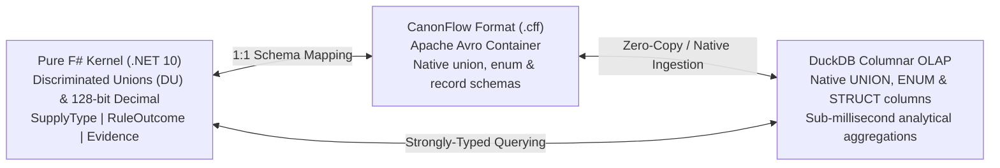

# GSTFlow: The Offline Trinity Architecture
**Strategic Blueprint & Capability Matrix (Post X-Ray Realignment)**

---

## 1. Core Engineering Pillars

### Pillar A: Aborting Fable-Dart & The `double.parse` Time Bomb
In statutory Indian GST validation, numeric precision is paramount. Standard floating-point arithmetic (IEEE 754 64-bit `double`) introduces binary representation drift (`0.1 + 0.2 != 0.3`). Under the Central Goods and Services Tax (CGST) Act, even a ₹0.01 drift across multi-item aggregations or rounding rules (Section 170) causes compliance and audit failures.
- **Why Fable-Dart & Flutter Pro are Aborted for Local Parsing:** Dart represents floating-point numbers as 64-bit doubles. Transpiling F#'s `System.Decimal` (true 128-bit exact decimal arithmetic) or parsing local payloads in Dart forced reliance on `double.parse` or fragile numeric mocks.
- **The Calculated Strategic Tradeoff (Avalonia UI Mobile Pro):** Because our Mobile Pro application consists of clean, focused inspection screens rather than bloated social media UI, taking the calculated risk on **Avalonia UI (.NET 10 / F#) Mobile** is the best architectural tradeoff. It allows our F# kernel (`GSTFlow.Rules`) to run natively on Android/iOS with **true 128-bit `System.Decimal` exact math**, F# Discriminated Unions (`DU`), embedded DuckDB, and Gemma Edge 2B AI—with zero floating-point drift!

---

### Pillar B: The Native Type Triangle (F# DU ↔ Apache Avro `.cff` ↔ DuckDB)
One of the greatest engineering strengths of our architecture is the **Zero-Impedance Type Triangle** connecting our F# domain model, our `.cff` storage file format, and our analytical database:



1. **F# Discriminated Unions (DU):** Our domain model (`GSTFlow.Core`) models statutory rules cleanly using rich F# DUs such as `SupplyType = B2B | B2C`, `RuleOutcome = Pass | Warning | Fail | Unknown`, and `EvidenceKind = Direct | Derived`.
2. **Apache Avro (`.cff` CanonFlow Format):** Unlike flat CSVs or stringly-typed JSON, Apache Avro natively supports **Tagged Unions (`union`)**, **Enumerations (`enum`)**, and **Records (`record`)**. Our `.cff` file format is an Apache Avro container that preserves F# DUs with 100% type fidelity and exact decimal representations.
3. **DuckDB Native DU & Struct Support:** Unlike row-based SQLite (which forces developers to flatten DUs into loose `VARCHAR` strings or fragile integers), **DuckDB natively supports `UNION`, `ENUM`, and nested `STRUCT` data types**. DuckDB ingests `.cff` Avro containers directly into columnar tables where our F# Discriminated Unions remain strongly typed and queryable at C-like speeds!

---

### Pillar C: On-Device AI & Unified Avalonia UI (Gemma Edge 2B + Skia → Impeller)
- **Gemma Edge 2B (On-Device Android AI for Pro):** For GSTFlow Pro mobile power users, we leverage **Gemma Edge 2B** (via MediaPipe / Android AICore NPU acceleration) for 100% offline invoice image/PDF receipt extraction directly on Android devices. Zero cloud uploads, zero privacy leaks.
- **Unified Avalonia UI (.NET / F#) Across Desktop & Mobile Pro:** We adopt a unified UI strategy centered on **Avalonia UI (.NET / F#)** across Desktop and Mobile Pro. By leveraging Avalonia's high-performance **Skia** rendering engine—and tracking its evolution toward next-generation GPU renderers like **Impeller**—we maintain a single, beautifully rendered F# UI codebase with uncompromised numeric precision.

---

## 2. The 3-Channel Strategic Blueprint ("Offline Always")

```mermaid
graph TD
    Kernel["Pure F# Rules Kernel (GSTFlow.Rules)<br/>Single Source of Truth • 100% Deterministic"]
    
    Kernel -->|Fable JS / Wasm| Web["1. Web Gateway<br/>Marketing Anchor & Quick Verifier"]
    Kernel -->|NativeAOT (.NET 10) + Avalonia| Desktop["2. Windows Desktop Heavy-Lifter<br/>The Enterprise Workhorse (Lion's Share)"]
    Kernel -->|Wasm Bundle| Lite["3A. GSTFlow Lite Mobile<br/>High-Speed Field App (<10MB)"]
    Kernel -->|.NET 10 + Avalonia Mobile| Pro["3B. GSTFlow Pro Mobile<br/>Avalonia Native • Gemma Edge 2B & QR Inspector"]

    subgraph DesktopCaps ["Desktop Capabilities (NativeAOT + DuckDB)"]
        D1["True 128-bit System.Decimal Math"]
        D2["Offline Local AI (llama.cpp)<br/>PDF Invoice -> Structured JSON"]
        D3["Embedded DuckDB OLAP Ledger"]
        D4["Apache Avro (.cff) Bulk Ingestion"]
    end

    subgraph MobileCaps ["Mobile Strategy (Lite vs Pro)"]
        M1["Lite: Zero Bloat • Instant JSON/ZIP Check"]
        M2["Pro: Avalonia .NET 10 • 128-bit Decimal Math"]
        M3["Pro: Offline Camera QR + Gemma Edge 2B AI"]
        M4["Export Avro (.cff) via USB OTG / QuickShare"]
    end

    Desktop -.- DesktopCaps
    Lite & Pro -.- MobileCaps
```

---

## 3. Detailed Channel Capability Matrix

### Channel 1: Web Gateway (The Marketing Anchor)
* **Target Persona:** Prospective users, quick one-off verifiers, public transparency checks.
* **Core Mission:** Provide an instant, zero-friction "taste" of deterministic GST validation directly in any browser.
* **Key Capabilities:**
  - **Zero-Cloud Client Execution:** 100% client-side Wasm/JS execution.
  - **Interactive Preflight Playground:** Inspect sample JSON invoices or upload custom payloads.
  - **Truthful Three-Tier Reporting:** Cleanly separates Passed checks, Factual Confirmation requests (`Unknown`), and Statutory Failures.
  - **Cryptographic CFF Stamping:** Instant SHA-256 (`payload_digest`) stamped ZIP generation.

---

### Channel 2: Windows Desktop (The Enterprise Heavy-Lifter)
* **Target Persona:** Chartered Accountants (CAs), CFOs, Tax Auditors, ERP Administrators.
* **Core Mission:** The primary powerhouse where balance sheets, bulk invoices, and complex reconciliations are processed.
* **Key Capabilities:**
  - **True 128-Bit Exact Math:** Powered by F# compiled to **NativeAOT** (`.NET 10`) exact decimal arithmetic.
  - **Offline Local AI PDF Ingestion:** Embedded offline `llama.cpp` runtime running quantized local models (e.g., Phi-3 / Llama-3-8B) to extract messy vendor PDF invoices into normalized GSTR-1 JSON completely air-gapped.
  - **DuckDB Embedded OLAP Ledger:** Embedded analytical columnar engine supporting native F# DUs (`UNION`/`ENUM`) for lightning-fast multi-period GST reconciliations.
  - **Apache Avro (`.cff`) Ingestion:** High-speed ingestion of `.cff` bundles exported from mobile inspectors.
  - **Avalonia UI (.NET / F#):** Hardware-accelerated Skia rendering across Windows, Linux, and macOS.

---

### Channel 3: Mobile Ecosystem (Two-Tier Deployment)

#### Tier 3A: GSTFlow Lite (The "Facebook Lite" of Tax Validation)
* **Target Persona:** Merchants on the move, field agents, low-storage/low-RAM Android devices.
* **Core Mission:** An ultra-lightweight (<10MB) native app wrapper around our Wasm engine focused strictly on speed and offline data integrity.
* **Key Capabilities:**
  - **Zero Bloat:** No AI models, no camera scanning weights. Instant startup.
  - **Offline JSON & ZIP Verification:** Full deterministic evaluation on the phone.
  - **Embedded DuckDB Lite Ledger:** Fast local storage of verified invoices preserving F# DU schemas.
  - **Avro (`.cff`) / ZIP Export:** One-tap export via Android ShareSheet or USB OTG.

#### Tier 3B: GSTFlow Pro (Avalonia Mobile • Gemma Edge 2B AI & QR Inspector)
* **Target Persona:** Field compliance auditors, logistics controllers, power users demanding on-device AI and uncompromised precision.
* **Core Mission:** Comprehensive physical invoice verification and local AI extraction toolkit built on **Avalonia UI (.NET 10 / F#) Mobile**.
* **Key Capabilities:**
  - **100% Uncompromised 128-Bit Decimal Precision:** By choosing **Avalonia UI Mobile**, the application runs natively on `.NET 10` on Android/iOS, executing `GSTFlow.Rules` with exact 128-bit `System.Decimal` math. Zero Dart `double.parse` float risk.
  - **Offline Camera QR Scanner:** Instant hardware camera scanning of B2B/B2C e-Invoice QR codes (extracting IRN, GSTINs, and signed totals).
  - **On-Device Gemma Edge 2B AI:** Leverages Google's **Gemma Edge 2B** parameter model (via MediaPipe / Android AICore NPU acceleration) for 100% offline receipt and PDF parsing directly on Android devices.
  - **Air-Gapped Avro (`.cff`) Export:** Package scanned invoices into compact Apache Avro containers for instant transfer via USB OTG or QuickShare to the CA's Desktop.

---

## 4. Capability Comparison Summary

| Feature / Capability | Web Gateway | Windows Desktop (Heavy-Lifter) | Mobile Lite (FB Lite Style) | Mobile Pro (Avalonia .NET 10 / Gemma Edge) |
| :--- | :---: | :---: | :---: | :---: |
| **Execution Environment** | Client Browser (Wasm/JS) | Windows NativeAOT (.NET 10) | Android Native Wrapper (Wasm) | Android Native (.NET 10 / Avalonia) |
| **Numeric Precision** | JS Number / BigInt Safe | **True 128-bit System.Decimal** | JS Number / BigInt Safe | **True 128-bit System.Decimal** |
| **Type Fidelity (F# DU)** | JS Objects / JSON | **100% Native DU ↔ DuckDB UNION** | JS Objects / DuckDB | **100% Native DU ↔ DuckDB UNION** |
| **Analytical Database** | Session State | **Embedded DuckDB (OLAP)** | **Embedded DuckDB** | **Embedded DuckDB (OLAP)** |
| **Data Interchange** | JSON / ZIP | **Apache Avro (.cff) / ZIP** | Apache Avro (.cff) / ZIP | Apache Avro (.cff) |
| **Offline AI Extraction** | ❌ (Keep Simple) | **✅ Local AI (`llama.cpp`)** | ❌ (Zero Bloat) | **✅ On-Device Gemma Edge 2B** |
| **Camera QR Scan** | ❌ | ❌ (No Camera Needed) | ❌ | **✅ Offline e-Invoice QR Scan** |
| **File Transfer Model** | Browser Download | Local Disk / USB OTG | OS ShareSheet / QuickShare | USB OTG / QuickShare |
